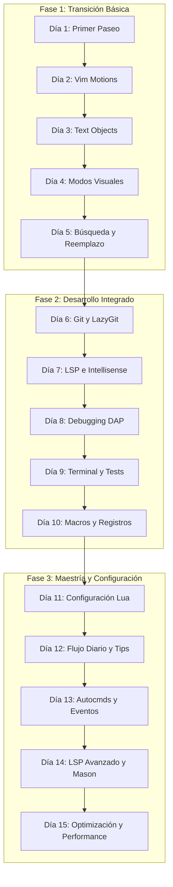

# Guía de Maestría: De VSCode a LazyVim en 15 Días (Dart/Flutter Edition)

¡Bienvenido a la guía definitiva de maestría! Este documento está diseñado para llevarte desde un usuario de VSCode dependiente del mouse hasta un **maestro de Neovim y LazyVim**, capaz de programar a la velocidad del pensamiento y personalizar tu propio entorno de desarrollo en Lua. Esta edición está adaptada específicamente para desarrolladores de **Dart y Flutter**.

Dedica solo **5 a 10 minutos al día** a realizar los ejercicios prácticos. No saltes de día hasta que los atajos del día actual se sientan naturales.

---

## 🛠️ Estructura del Aprendizaje (De Novato a Maestro)



---

## 🧪 Laboratorio de Práctica Local (En Dart)
Hemos creado un directorio de laboratorios prácticos interactivos en Dart al lado de esta guía. Abre cada archivo con Neovim para realizar tus ejercicios del día:
* 📂 **Directorio de Laboratorios:** [ejercicios_practica/](file:///home/iducdev/Escritorio/-GUIAS-DE-APRENDIZAJE-DETALLADA-BACKEND-INFRAESTRUCTURA/modulo_2_Nvim_lazyvim/ejercicios_practica/)

---

## Día 1 — Tu primer paseo (5 min)

Abrí Neovim y familiarizate con la interfaz y el explorador de archivos.

### Comandos del día:
```vim
nvim .                 " Abrir LazyVim en el directorio actual
<space>                " Presioná la tecla líder (ESPACIO) -> verás el menú Which-Key
<space> + e            " Abrir/cerrar el explorador de archivos lateral (Neo-tree)
j / k                  " Mover el cursor abajo / arriba en el explorador
<Enter>                " Abrir el archivo seleccionado
<space> + ff           " Buscar archivos por nombre (Telescope, equivalente a Ctrl+P en VSCode)
:q + Enter             " Salir de Neovim
```

**🎯 Objetivo**: Entender el concepto de la tecla Leader (`<space>`), buscar un archivo y saber cómo entrar y salir del editor.

---

## Día 2 — Movimiento nativo (Vim Motions) (5 min)

**¡Prohibido usar las flechas del teclado!** Mantén tus manos en la posición base de mecanografía (`asdf jklñ`).

### Movimientos básicos:
* `h` : Izquierda
* `j` : Abajo
* `k` : Arriba
* `l` : Derecha

### Movimientos rápidos (Palabras y Líneas):
* `w` : Salta al inicio de la **siguiente** palabra (*word*).
* `b` : Salta al inicio de la palabra **anterior** (*back*).
* `e` : Salta al **final** de la palabra actual/siguiente.
* `0` (cero) : Va al inicio absoluto de la línea.
* `$` : Va al final absoluto de la línea.
* `gg` : Va a la primera línea del archivo.
* `G` : Va a la última línea del archivo.

### 🧪 Práctica en el Laboratorio:
* Abre el archivo [ejercicio_dia_02_movimientos.dart](file:///home/iducdev/Escritorio/-GUIAS-DE-APRENDIZAJE-DETALLADA-BACKEND-INFRAESTRUCTURA/modulo_2_Nvim_lazyvim/ejercicios_practica/ejercicio_dia_02_movimientos.dart) con `nvim` y sigue las instrucciones en pantalla.

**🎯 Objetivo**: Moverte por cualquier archivo de código de forma fluida sin tocar las flechas ni el mouse.

---

## Día 3 — Edición supersónica y Text Objects (10 min)

En Vim, editar se resume en la fórmula: **Operador + Objeto de Texto**.

### Los Operadores:
* `c` : Cambiar (*Change*) -> Borra y entra en modo Insertar.
* `d` : Borrar (*Delete*).
* `y` : Copiar (*Yank*).

### Los Text Objects (Objetos de texto):
* `iw` : Palabra interna (*inner word*).
* `i"` : Texto dentro de comillas dobles.
* `i'` : Texto dentro de comillas simples.
* `i(` o `i)` : Texto dentro de paréntesis.
* `i{` o `i}` : Texto dentro de llaves (bloques de código).
* `ip` : Párrafo interno.
* *Reemplazando la `i` por `a` incluye los contenedores (ej. `ca"` cambia el texto y las comillas).*

### El punto mágico (`.`):
El punto repite la última acción de edición. Es el atajo de automatización más simple y potente.

### 🧪 Práctica en el Laboratorio:
* Abre el archivo [ejercicio_dia_03_edicion.dart](file:///home/iducdev/Escritorio/-GUIAS-DE-APRENDIZAJE-DETALLADA-BACKEND-INFRAESTRUCTURA/modulo_2_Nvim_lazyvim/ejercicios_practica/ejercicio_dia_03_edicion.dart) con `nvim` y realiza los 5 ejercicios interactivos.

**🎯 Objetivo**: Dejar de arrastrar el mouse para seleccionar y reemplazar texto.

---

## Día 4 — Modos Visuales y Selección en Bloque (5 min)

A veces necesitas seleccionar texto visualmente antes de aplicar cambios, o editar varias líneas simultáneamente de manera vertical.

### Los Modos Visuales:
* `v` : Modo Visual (carácter por carácter).
* `V` (mayúscula) : Modo Visual de Línea (selecciona líneas completas).
* `Ctrl + v` : Modo Visual de Bloque (selección vertical/columnas).

### 🧪 Práctica en el Laboratorio:
* Abre el archivo [ejercicio_dia_04_bloque_visual.dart](file:///home/iducdev/Escritorio/-GUIAS-DE-APRENDIZAJE-DETALLADA-BACKEND-INFRAESTRUCTURA/modulo_2_Nvim_lazyvim/ejercicios_practica/ejercicio_dia_04_bloque_visual.dart) con `nvim` y realiza las tareas de inserción multilínea y reemplazo en bloque.

**🎯 Objetivo**: Dominar la edición vertical en bloque (el verdadero "multi-cursor" de Vim).

---

## Día 5 — Búsqueda y Reemplazo (8 min)

Aprende a buscar y reemplazar rápidamente, tanto en el archivo actual como en todo tu proyecto.

### Búsqueda en el archivo actual:
* `/` + palabra : Busca la palabra en el archivo actual. Presiona `Enter` para confirmar.
* `n` : Salta a la **siguiente** coincidencia.
* `N` : Salta a la coincidencia **anterior**.
* `*` : Busca automáticamente la palabra bajo el cursor en todo el archivo.

### Reemplazo en el archivo actual (Modo Comando):
* `:%s/viejo/nuevo/g` : Reemplaza todas las ocurrencias de "viejo" por "nuevo" en todo el archivo.
* `:%s/viejo/nuevo/gc` : Igual al anterior, pero pidiendo confirmación paso a paso.

### Búsqueda y Reemplazo en todo el Proyecto (LazyVim):
* `<space> + sg` : Busca un texto globalmente en todo el proyecto (*Search Grep*).
* `<space> + sr` : Abre **Grug-Far**, la herramienta visual de búsqueda y reemplazo global integrada en LazyVim. Es ultra rápida y te permite reemplazar texto masivamente con previsualización en tiempo real.

### 🧪 Práctica en el Laboratorio:
* Abre el archivo [ejercicio_dia_05_reemplazo.dart](file:///home/iducdev/Escritorio/-GUIAS-DE-APRENDIZAJE-DETALLADA-BACKEND-INFRAESTRUCTURA/modulo_2_Nvim_lazyvim/ejercicios_practica/ejercicio_dia_05_reemplazo.dart) con `nvim` y ejecuta los reemplazos interactivos y con confirmación.

**🎯 Objetivo**: Moverte instantáneamente al punto del código que necesitas y realizar reemplazos globales seguros.

---

## Día 6 — Control de Versiones con Git (LazyGit) (5 min)

LazyVim incluye **LazyGit**, una de las mejores interfaces de Git para terminal.

### Comandos globales de Git:
```vim
<space> + gg  " Abre LazyGit en una ventana flotante gigante
```

### Dentro de LazyGit:
1. Usa `j/k` para moverte entre los archivos modificados.
2. Presiona `Space` para añadir un archivo al *Stage* (o `a` para añadir todos).
3. Presiona `c` para escribir un mensaje de commit, presiona `Enter` para confirmar.
4. Presiona `P` (mayúscula) para hacer `git push`.
5. Presiona `q` para cerrar LazyGit y volver a tu código.

### Atajos rápidos (sin abrir LazyGit):
* `<space> + gd` : Ver diferencias (*diff*) del archivo actual.
* `<space> + gl` : Ver el historial de commits (*log*).
* `<space> + gb` : Muestra quién escribió la línea actual (*git blame*).

**🎯 Objetivo**: Hacer commits, ramas y pushes sin tener que abrir una terminal externa o usar extensiones pesadas de VSCode.

---

## Día 7 — LSP e Inteligencia de Código (5 min)

LazyVim detecta automáticamente tu entorno de Dart/Flutter e instala el servidor LSP correspondiente a través de `flutter-tools` o `dartls`.

### Comandos clave de navegación inteligente:
* `gd` : Ir a la definición de la clase/función bajo el cursor (*Go to Definition*).
* `gr` : Mostrar referencias de la variable/función (*Go to References*).
* `K` : Muestra la documentación o tipo de dato de la palabra bajo el cursor (Hover).
* `<space> + ca` : Acciones de código (*Code Actions* - soluciones rápidas, importaciones automáticas, envolturas de widgets).
* `<space> + cr` : Renombrar variable en todo el proyecto de forma segura (*Rename*).
* `<space> + cf` : Formatear código del archivo actual (Dart format).

### Diagnóstico de errores:
* `]d` / `[d` : Salta al siguiente / anterior error o advertencia en el archivo.
* `<space> + xx` : Abre **Trouble**, un panel inferior interactivo con la lista de todos los errores de tu proyecto.

**🎯 Objetivo**: Obtener asistencia de autocompletado y tipado idéntica o superior a la de VSCode.

---

## Día 8 — Depuración de Código (DAP) (8 min)

Depura tu aplicación de Flutter o Dart paso a paso usando el protocolo DAP (*Debug Adapter Protocol*) configurado en LazyVim.

### Atajos de Debugging:
```vim
<space> + db  " Añadir o quitar Breakpoint en la línea actual
<space> + dc  " Iniciar debug (arranca la app móvil, web o de consola y se detiene en los breakpoints)
<space> + du  " Mostrar / Ocultar la UI de debug (ventanas de variables, watches, etc.)
<space> + do  " Step Over (ejecutar la línea actual sin entrar a funciones)
<space> + di  " Step Into (entrar a la función)
<space> + dO  " Step Out (salir de la función actual)
<space> + dq  " Detener la sesión de depuración
```

**🎯 Objetivo**: Encontrar bugs inspeccionando el estado de las variables en tiempo real sin llenar tu código de `print()`.

---

## Día 9 — Terminal Integrada y Tests (5 min)

No dejes tu editor para correr scripts de desarrollo o tests.

### Terminal:
* `<space> + ft` : Abre una terminal flotante.
* `Ctrl + /` (o `Ctrl + 7` en algunos teclados) : Abre y cierra rápidamente la terminal (como `Ctrl + ñ` en VSCode).
* *Para cerrarla del todo, escribe `exit` en la terminal o pulsa `q` en la ventana.*

### Tests Unitarios/Integración (Neotest):
LazyVim agrupa tus tests de Dart y Flutter bajo estos atajos:
* `<space> + tt` : Corre el test más cercano al cursor.
* `<space> + tf` : Corre todos los tests del archivo actual.
* `<space> + ts` : Muestra el estado del árbol de tests en tiempo real.

**🎯 Objetivo**: Mantener tu ciclo de desarrollo ágil corriendo comandos de compilación y pruebas en décimas de segundo.

---

## Día 10 — Automatización: Macros, Marcas y Registros (10 min)

Llegó el momento de automatizar tareas complejas.

### 1. Las Macros (Grabar y reproducir):
Las macros guardan una secuencia de pulsaciones para repetirlas cuando quieras.
* `q` + `letra` (ej. `qa`): Empieza a grabar en el registro `a`.
* Realiza las ediciones que necesites (asegúrate de que terminen con un movimiento constante, como bajar una línea `j`).
* `q` : Detiene la grabación.
* `@a` : Ejecuta la macro guardada en `a`.
* `10@a` : Ejecuta la macro 10 veces seguidas.

### 2. Las Marcas (Teletransportación en archivos):
* `m` + `letra` (ej. `ma`): Marca la posición actual con la letra `a`.
* `'a` : Te lleva a la línea de la marca `a` desde cualquier parte del archivo.

### 3. Los Registros (Portapapeles múltiples):
Vim tiene muchos portapapeles. Si copias algo, no sobreescribe lo anterior si usas registros.
* `"ayw` : Copia la palabra actual en el registro `a`.
* `"ap` : Pega el contenido del registro `a`.
* **Portapapeles del sistema**:
  * `"+y` : Copia el texto seleccionado al portapapeles de tu sistema operativo (para pegarlo en Chrome, Slack, etc.).
  * `"+p` : Pega desde el portapapeles del sistema a Neovim.

### 🧪 Práctica en el Laboratorio:
* Abre el archivo [ejercicio_dia_10_macros.dart](file:///home/iducdev/Escritorio/-GUIAS-DE-APRENDIZAJE-DETALLADA-BACKEND-INFRAESTRUCTURA/modulo_2_Nvim_lazyvim/ejercicios_practica/ejercicio_dia_10_macros.dart) con `nvim` y realiza la tarea de formateo de objetos usando una macro grabada.

**🎯 Objetivo**: Evitar la edición manual de datos repetitivos y gestionar tu portapapeles de manera avanzada.

---

## Día 11 — Haz tuyo LazyVim (Configuración) (10 min)

LazyVim está diseñado para ser altamente modular. Su configuración reside en tu carpeta de usuario: `~/.config/nvim/`.

### Estructura de archivos sugerida:
```bash
~/.config/nvim/
├── lua/
│   ├── config/
│   │   ├── lazy.lua      # Carga del gestor de plugins y configuraciones base
│   │   ├── keymaps.lua   # Tus atajos de teclado personalizados
│   │   └── options.lua   # Configuración de Vim (números de línea, tabulaciones, etc.)
│   └── plugins/
│       ├── UI.lua        # Temas o modificaciones estéticas
│       └── coding.lua    # Plugins de autocompletado, formateadores, etc.
└── init.lua              # Archivo de entrada de Neovim
```

### ¿Cómo agregar un Plugin?
Para instalar un plugin (por ejemplo, un tema o una utilidad nueva), crea un archivo dentro de `lua/plugins/mi_plugin.lua` con esta estructura:
```lua
return {
  -- Ejemplo: Instalando Github Copilot
  {
    "zbirenbaum/copilot.lua",
    cmd = "Copilot",
    event = "InsertEnter",
    config = function()
      require("copilot").setup({})
    end,
  },
}
```
Al reiniciar Neovim, Lazy.nvim detectará el archivo, descargará e instalará el plugin automáticamente.

**🎯 Objetivo**: Perder el miedo al código Lua y ser capaz de extender tu editor a tu gusto.

---

## Día 12 — Flujo de Trabajo Integrado

Unifica todo lo aprendido en tu flujo de trabajo del mundo real.

### Tu flujo de trabajo diario recomendado:
1. **Entrar al proyecto**: Abre tu terminal, navega a tu proyecto y escribe `nvim .`.
2. **Navegar y buscar**: Usa `<space> ff` para abrir el archivo en el que vas a trabajar.
3. **Programar sin mouse**: Muévete con `w`, `b`, `gd` y edita usando `ciw`, `ci"` o bloque visual (`Ctrl+v`).
4. **Validar**: Revisa advertencias con `]d` o formatea con `<space> cf`.
5. **Git y Guardar**: Guarda con `Ctrl+s`, abre LazyGit con `<space> gg`, haz commit y push en segundos.
6. **Salir**: Sal de Neovim con `:q` o déjalo abierto en una pestaña de tu terminal.

---

## ⚡ Fase de Maestría Avanzada (Días 13 a 15)

---

## Día 13 — Autocmds y Eventos (Lua Scripting) (10 min)

Los autocomandos (*Autocmds*) son el alma de la automatización en Neovim. Permiten ejecutar código Lua cuando ocurren eventos específicos del editor (guardar un archivo, abrir un tipo de archivo, cambiar de buffer, etc.).

Abre tu archivo `~/.config/nvim/lua/config/autocmds.lua` (o créalo si no existe) e implementa estas automatizaciones de nivel maestro:

### 1. Resaltar texto copiado (Visual FeedBack)
Hace que el texto brille por una fracción de segundo al copiarlo (`yank`):
```lua
vim.api.nvim_create_autocmd("TextYankPost", {
  desc = "Resaltar texto al copiar",
  callback = function()
    vim.highlight.on_yank({
      higroup = "IncSearch",
      timeout = 150,
    })
  end,
})
```

### 2. Auto-crear directorios al guardar
Si guardas un archivo nuevo dentro de una carpeta que no existe, Neovim creará la carpeta automáticamente en lugar de dar error:
```lua
vim.api.nvim_create_autocmd("BufWritePre", {
  desc = "Crear directorios intermedios al guardar",
  callback = function(event)
    if event.match:match("^%w%w+://") then return end
    local file = vim.loop.fs_realpath(event.match) or event.match
    vim.fn.mkdir(vim.fn.fnamemodify(file, ":h"), "p")
  end,
})
```

### 3. Ajustes específicos por Lenguaje (Filetypes)
Por ejemplo, hacer que en archivos `go` los tabuladores sean reales de 4 espacios, pero en `dart` o `yaml` sean 2 espacios:
```lua
vim.api.nvim_create_autocmd("FileType", {
  pattern = { "dart", "yaml" },
  callback = function()
    vim.opt_local.expandtab = true
    vim.opt_local.tabstop = 2
    vim.opt_local.shiftwidth = 2
  end,
})
```

**🎯 Objetivo**: Hacer que tu editor reaccione inteligentemente a tus acciones y se adapte al contexto de forma automatizada.

---

## Día 14 — LSP Avanzado y Mason en Dart/Flutter (10 min)

Mason es el gestor de paquetes de Neovim para LSPs, Linters y Formateadores. Para dominar el LSP necesitas saber cómo personalizar sus respuestas y configuraciones.

### 1. El Menú de Mason
* Ejecuta `:Mason` en Neovim.
* Usa `i` para instalar un servidor, `u` para actualizarlo y `X` para desinstalarlo.
* Puedes instalar herramientas de soporte como `yaml-language-server` (para pubspec.yaml) o `json-lsp`.

### 2. Configurar flutter-tools.nvim
Para tener una experiencia perfecta en Flutter, se utiliza el plugin `flutter-tools.nvim` en lugar del lspconfig crudo. Configúralo en `lua/plugins/flutter.lua`:
```lua
return {
  {
    "akinsho/flutter-tools.nvim",
    lazy = false,
    dependencies = {
      "nvim-lua/plenary.nvim",
      "stevearc/dressing.nvim", -- UI para code actions mejorada
    },
    config = function()
      require("flutter-tools").setup({
        lsp = {
          color_parameters = true, -- Colorea vistas previas de colores en el código
          settings = {
            showTodos = true,
            completeFunctionCalls = true,
          },
        },
      })
    end,
  },
}
```

### 3. Configurar formateado al guardar en Dart
Asegúrate de que Conform.nvim use el formateador oficial de Dart. Edita o crea `lua/plugins/formatting.lua`:
```lua
return {
  {
    "stevearc/conform.nvim",
    opts = {
      formatters_by_ft = {
        dart = { "dart_format" },
      },
    },
  },
}
```

**🎯 Objetivo**: Tener el control total sobre qué servidores de lenguaje y formateadores corren en tu máquina y cómo reportan sus diagnósticos.

---

## Día 15 — Optimización Extrema y Performance (10 min)

Un Neovim maestro debe abrir de manera **instantánea** (menos de 40ms). Para lograr esto, usamos el concepto de *Lazy-loading* (carga perezosa) implementado por el plugin `lazy.nvim`.

### 1. Medir el Rendimiento
* Abre Neovim y escribe `:Lazy`.
* En la parte superior verás el tiempo de inicio exacto (ej. `Loaded (12) 24ms`).
* Presiona `P` dentro del menú de Lazy para ver el **Profile** detallado de qué plugins tardaron más en cargar.

### 2. Reglas de Lazy-Loading en tus Plugins
Cuando instales tus plugins en la carpeta `lua/plugins/`, no cargues todo de golpe. Usa disparadores:
* `event`: Carga el plugin en un evento de Neovim.
  * `"VeryLazy"`: Evento recomendado para la mayoría de utilidades que no necesitas al milisegundo de arrancar.
  * `"BufReadPost"`: Carga cuando empiezas a leer un buffer (archivo).
  * `"InsertEnter"`: Carga el plugin solo cuando entras al modo Insertar (perfecto para autocompletado y copilot).
* `cmd`: Carga el plugin solo cuando ejecutas un comando específico (ej. `cmd = "MarkdownPreview"`).
* `ft`: Carga el plugin solo cuando abres un tipo de archivo determinado (ej. `ft = "dart"`).
* `keys`: Carga el plugin solo cuando presionas cierta combinación de teclas.

### Ejemplo de Configuración Optimizada:
```lua
return {
  {
    "windwp/nvim-ts-autotag",
    event = { "BufReadPost", "BufNewFile" }, -- No se carga hasta abrir un archivo
    config = function()
      require("nvim-ts-autotag").setup()
    end,
  },
}
```

**🎯 Objetivo**: Mantener tu editor ligero, rápido y eficiente sin importar cuántos plugins decidas instalar en el futuro.

---

## Tabla Definitiva de Atajos Rápidos (Machete de Referencia)

| Categoría | Acción | Atajo en LazyVim |
|---|---|---|
| **Navegación** | Buscar archivos (Ctrl+P) | `<space> ff` |
| | Buscar texto global (Ctrl+Shift+F) | `<space> sg` |
| | Explorador de archivos (Ctrl+B) | `<space> e` |
| | Ver buffers abiertos | `<space> ,` |
| **Edición** | Cambiar palabra bajo el cursor | `ciw` |
| | Cambiar texto dentro de comillas | `ci"` |
| | Copiar párrafo actual | `yip` |
| | Pegar | `p` |
| | Repetir última acción | `.` |
| | Seleccionar bloque vertical | `Ctrl + v` |
| **Código/LSP** | Ir a definición | `gd` |
| | Ver referencias | `gr` |
| | Renombrar variable global | `<space> cr` |
| | Acciones de código | `<space> ca` |
| | Formatear archivo | `<space> cf` |
| | Siguiente error | `]d` |
| | Ver lista de errores | `<space> xx` |
| **Git** | Abrir LazyGit | `<space> gg` |
| | Ver blame de la línea | `<space> gb` |
| **Terminal** | Terminal flotante | `<space> ft` / `Ctrl + /` |
| **Debug** | Iniciar Debugger | `<space> dc` |
| | Poner/Quitar Breakpoint | `<space> db` |
| | UI de Debugger | `<space> du` |

---

> [!IMPORTANT]
> Recuerda que no se trata de usar todos los atajos a la vez. Incorpora un comando nuevo a tu rutina cada día y, en pocas semanas, programarás de forma completamente automática. ¡Mucha suerte en tu camino a la maestría de Neovim!
